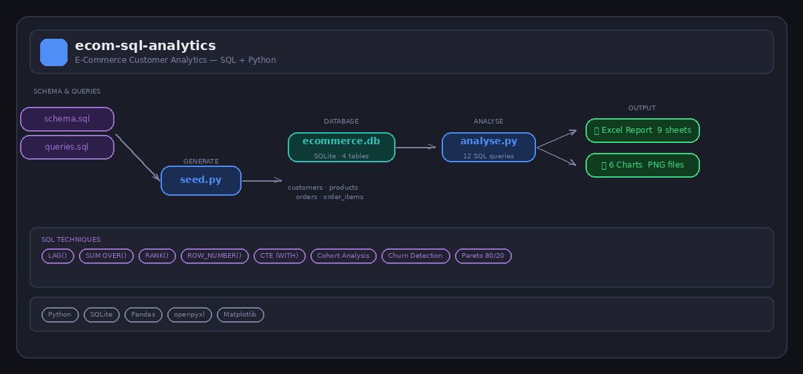

# E-Commerce Customer Analytics — SQL + Python

An advanced data analytics project built around a multi-table relational database. Demonstrates the SQL skills required in real data analyst roles: window functions, CTEs, cohort analysis, churn detection, and Pareto analysis — all run via Python and exported to a formatted Excel report.


---

## SQL Techniques Demonstrated

| Technique | Query |
|---|---|
| `LAG` window function | Month-on-month revenue growth |
| `SUM OVER` window function | Cumulative running total revenue |
| `RANK` / `ROW_NUMBER` | Customer LTV ranking, Pareto segmentation |
| Rolling average (`AVG OVER ROWS`) | 3-month rolling average order value |
| CTEs (`WITH` clauses) | All complex queries — readable multi-step logic |
| Multi-table JOINs | 3–4 table joins across all queries |
| Cohort retention analysis | Acquisition month vs active order months |
| Churn detection | `julianday()` date arithmetic — 90/180 day flags |
| `CASE WHEN` segmentation | Buyer tiers, churn risk labels |
| Pareto / ABC analysis | 80/20 revenue concentration |
| Subqueries | Nested CTEs for ranked aggregations |

---

## What the Project Analyses

- **Monthly revenue trend** — with MoM growth % and cumulative running total
- **Customer Lifetime Value (CLV)** — by segment (B2C, B2B, Enterprise), ranked
- **Top 20 customers** — ranked by lifetime value with RANK()
- **Pareto analysis** — do the top 20% of customers drive 80% of revenue?
- **Product performance** — revenue, units sold, price, ranked
- **Buyer frequency tiers** — one-time, occasional, regular, loyal
- **Churn risk** — customers inactive 90+ days, flagged High / Medium Risk
- **Acquisition channel ROI** — revenue per customer by channel
- **Average order value trend** — monthly with 3-month rolling average
- **Category revenue mix** — with cumulative ABC share

---

## Database Schema

4 linked tables — a proper relational structure:

```
customers     → customer_id, name, segment, region, channel, acquired_date
products      → product_id, name, category, unit_price
orders        → order_id, customer_id, order_date, status
order_items   → item_id, order_id, product_id, quantity, unit_price
```

---

## How to Run

```bash
pip install -r requirements.txt

# Step 1 — create the database and seed with data
python seed.py

# Step 2 — run all SQL queries, export Excel report and charts
python analyse.py
```

---

## Output

- `output/ecom_analytics_report.xlsx` — 9-sheet formatted Excel report
- `output/charts/` — 6 matplotlib charts (revenue trend, CLV, product ranking, Pareto, churn, channel)
- `queries.sql` — all 12 SQL queries with comments, ready to run in any SQL client

---

## Technologies

Python · SQLite · Pandas · Matplotlib · openpyxl · SQL (CTEs · Window Functions · JOINs)
